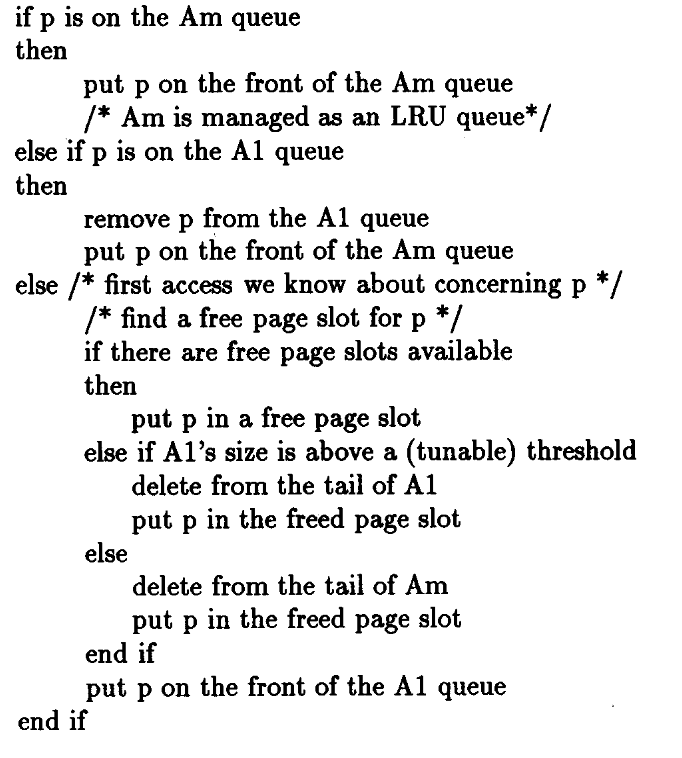

# 2Q Cache System 
---
## Table of Contents
1. [Introduction](#introduction)
2. [Compilation Instructions](#compilation-instructions)
3. [Class and Method Descriptions](#class-and-method-descriptions)
4. [Usage Examples](#usage-examples)
5. [Running Tests](#running-tests)
6. [Notes](#notes)

## Introduction
This project implements a **2Q Cache System**, which is a two-level cache structure used to manage frequently accessed elements more efficiently. The cache is divided into two queues:
- **Main Queue** (Q1) – for frequently accessed elements.
- **Out Queue**  (Q2) – for recently evicted elements.

The main goal of the cache is to track and improve the hit ratio for repeated accesses.

## Compilation Instructions
To compile the project, you can use the provided **Makefile**. The compiler used is `g++`, and the compilation flags enable debugging, set the C++17 standard, and enforce strict error checking.

### Steps:
1. Clone the repository or download the code.
2. Ensure that `g++` is installed on your system.
3. Run the following command to build the project:
   ```bash
   make all
   ```
   This will generate an executable named `./cache.x`.

4. To run tests, use:
   ```bash
   make test
   ```
5. To run ideal cache, use:
   ```bash
   make ideal_cache
   ```

6. To clean the compiled files, use:
   ```bash
   make clear
   ```

## Class and Method Descriptions

### Class: `Cache_2Q<T>`
This is a templated class that implements the 2Q caching algorithm.

#### Private Members:
- **`struct Elem_hash_t`**: Stores the cached element and the queue it belongs to (Main Queue or Out Queue).
- **`struct In_queue`**: Represents the Main Queue, which stores frequently accessed elements.
- **`struct Out_queue`**: Represents the Out Queue, which stores recently evicted elements.
- **`std::unordered_map<T, Elem_hash_t> hash_t`**: Hash map that links elements to their cache information.
  
#### Public Methods:
- **`void create_cache(uint64_t cache_size)`**:
  Initializes the cache with a specified size, where the Main Queue occupies 20% of the cache, and the Out Queue occupies 80%.
  
- **`uint32_t cache_elem(T elem)`**:
  Caches the element according to the 2Q algorithm. If the element is already in the cache, it adjusts its position within the appropriate queue.

- **`void clear()`**:
  Clears both queues and resets the cache.

#### Private Methods:
- **`uint32_t find_in_cache(T elem)`**:
  Searches for the element in the cache and moves it between queues if necessary. It returns 1 if the element is found, otherwise 0.

### Main Execution Flow (in `main.cpp`):
1. **`main()`**:
   - Prompts the user for the cache size.
   - Accepts elements as input and caches them.
   - Calculates the hit ratio after all inputs are processed.
   
### Example of Main Flow:
```cpp
Cache_2Q<int> cache;
cache.create_cache(10);      // Creates a cache of size 10
cache.cache_elem(1);         // Adds element 1 to the cache
cache.cache_elem(2);         // Adds element 2 to the cache
cache.cache_elem(1);         // Hits the cache as element 1 is already cached
cache.clear();               // Clears the cache
```

## Usage Examples

### Example 1: Basic Usage
```bash
Input the size of cache
5
Input number of elemets
7
Input elements
1 2 3 4 5 6 7
number of strikes = 0
0%
```

### Example 2: Cache Hit
```bash
Input the size of cache
5
Input number of elemets
6
Input elements
1 1 2 3 2 4
number of strikes = 2
33%
```

## Class Ideal_cache
   The ideal algorithm based of 'prediction of a future'. Has better reults of hits than 2Q algorithm.
   You can run ideal cache in tests.cpp by using flag *-Ideal_cache*.


## Running Tests
The `tests.cpp` file provides several test cases to validate the functionality of the cache system. To run the tests:
1. After compiling the code, execute the binary:
   ```bash
   make test
   ```
2. After running, the test results will be displayed in the terminal.

The test cases cover different scenarios such as repeated element access, evictions, and cache hits.

### Example Test Case:
```cpp     
             // size       elements          hits               
Test tests[] = {{10, {1, 2, 4, 5, 7, 8, 9},    0},
                {10, {1, 1, 1, 2, 2, 2, 2, 3}, 5},
                ...
};
```
## Test_big_data
- The function generate 10'000'000 numbers for testing cache 
- you can put these numbers into file_test.txt
```bash
   ./test_data.x > file_test.txt
```
- put numbers into cache.x
```bash
   ./cache.x < file_test.txt
```

## Notes
- The program uses a 2Q caching strategy, where the Main Queue takes up 20% of the cache size, and the Out Queue holds 80%.
- To enable debugging information, you can define the `Debug` macro in `cache.hpp`. This will print detailed cache operations to the console during execution.

---

- pseudocode of basic 2Q algotithm
---

  
### Compilation Debug Example:
```bash
g++ -D Debug -std=c++17 -o cache.x main.cpp -I./include

g++ -D Debug -std=c++17 -o test.x src/tests.cpp -I./include
```
